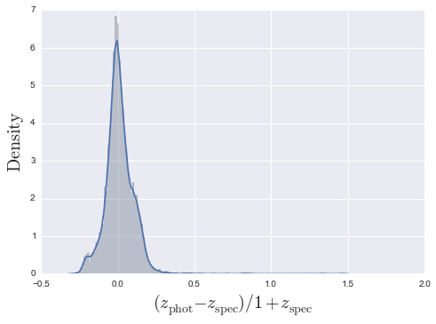
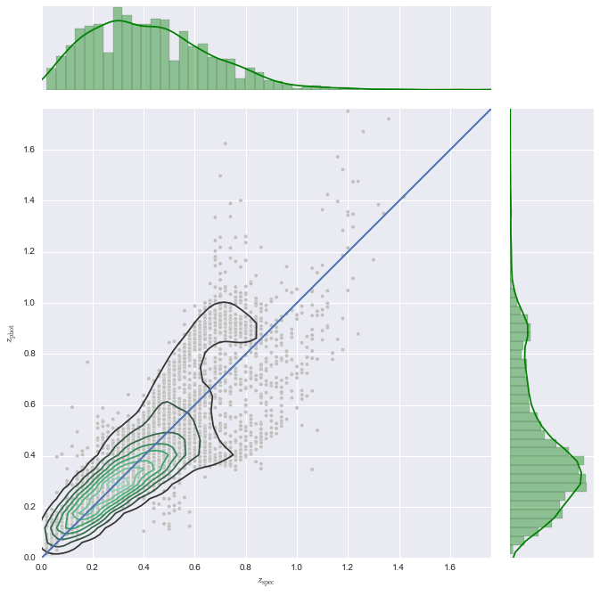
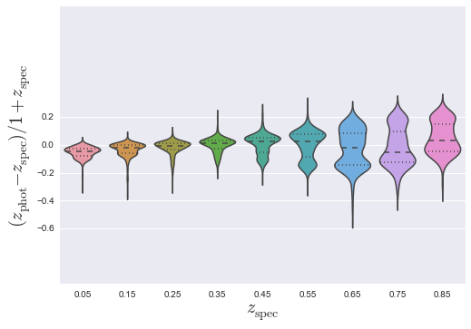
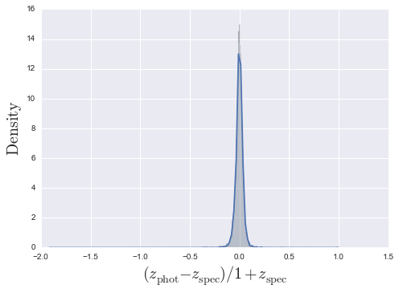
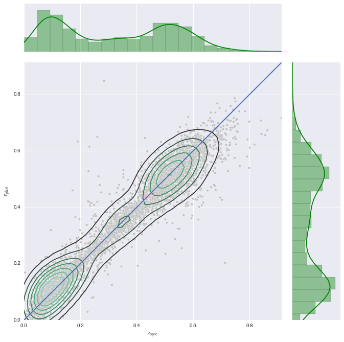
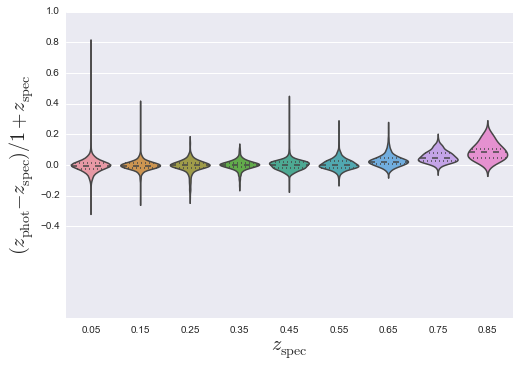
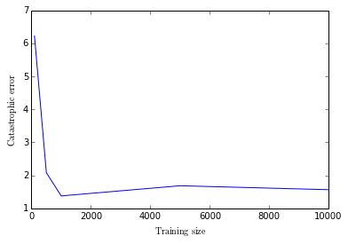

Examples
========

.. raw:: html

   <h1>
   
PHAT0

.. raw:: html

   </h1>
   
   

   
We first show the usage of GLMs to fit synthetic redshifts. We have
a dataset that has both magnitudes and redshifts for each object.

.. raw:: html

   

   

.. code:: python

    %matplotlib inline
    from photoz import PhotoSample

.. raw:: html

   

   
Make an instance of the PhotoSample class and define the filename
of your sample

.. raw:: html

   

   

.. code:: python

    PHAT0 = PhotoSample(filename="../data/PHAT0.csv", family="Gamma", link="log")

.. raw:: html

   

   
Let's specify the number of PCAs we want to fit and the size of the
training sample

.. raw:: html

   

   

.. code:: python

    PHAT0.num_components = 5
    PHAT0.test_size = 5000

.. raw:: html

   

   
Now run the PCA decomposition and GLM fitting

.. raw:: html

   

   

.. code:: python

    PHAT0.run_full()

.. parsed-literal::

    <matplotlib.figure.Figure at 0xb1a11a2c>

.. raw:: html

   <h1>
   
Real Data

.. raw:: html

   </h1>
   
   

   
We now show you how to use a dataset to train your GLM model and
then how to fit it to a separate testing dataset. We also show that
you can use the Quantile family rather than a Gamma family.

.. raw:: html

   

   

.. code:: python

    SDSS = PhotoSample(filename_train="../data/SDSS_train.csv", filename_test="../data/SDSS_test.csv", family="Quantile")

.. raw:: html

   

   
We note that the training set contains redshift, but the test
dataset does not contain a redshift field. We run each step
independently to show you the innards of run\_all() work. Utilising
the library in an object-oriented manner allows you to interact in
a more easier manner when investigating such things as the training
sample size. See later for an example.

.. raw:: html

   

   

.. raw:: html

   <h2>
   
Applying the GLM to the SDSS

.. raw:: html

   </h2>
   

   

1. We run principle component analysis to ensure that each
   component is orthogonal (independent and identically distributed).
   
.. raw:: html

      

      

.. code:: python

    SDSS.do_PCA()
    print("PCA has decided to use {0} components".format(SDSS.num_components))

.. parsed-literal::

    PCA has decided to use 4 components

.. raw:: html

   

   

2. First we ensure the datasets are resplit after PCA and carry out
   the GLM fitting.
   
.. raw:: html

      

      

.. code:: python

    SDSS.split_sample(random=False)
    SDSS.do_GLM()

.. parsed-literal::

                             QuantReg Regression Results                          
    ==============================================================================
    Dep. Variable:               redshift   Pseudo R-squared:               0.8158
    Model:                       QuantReg   Bandwidth:                    0.008182
    Method:                 Least Squares   Sparsity:                      0.08200
    Date:                Tue, 19 Aug 2014   No. Observations:                10000
    Time:                        15:05:54   Df Residuals:                     9984
                                            Df Model:                           15
    ===================================================================================
                          coef    std err          t      P>|t|      [95.0% Conf. Int.]
    -----------------------------------------------------------------------------------
    Intercept           0.3156      0.000    692.656      0.000         0.315     0.317
    PC1                 0.0493      0.000    385.097      0.000         0.049     0.050
    PC2                -0.0322      0.001    -43.416      0.000        -0.034    -0.031
    PC1:PC2             0.0045      0.000     21.331      0.000         0.004     0.005
    PC3                 0.2093      0.002    103.342      0.000         0.205     0.213
    PC1:PC3            -0.0213      0.000    -45.427      0.000        -0.022    -0.020
    PC2:PC3             0.0409      0.001     28.324      0.000         0.038     0.044
    PC1:PC2:PC3        -0.0096      0.000    -25.380      0.000        -0.010    -0.009
    PC4                 0.2813      0.006     46.342      0.000         0.269     0.293
    PC1:PC4            -0.0003      0.002     -0.213      0.831        -0.003     0.003
    PC2:PC4            -0.2007      0.006    -31.264      0.000        -0.213    -0.188
    PC1:PC2:PC4         0.0321      0.002     19.469      0.000         0.029     0.035
    PC3:PC4            -0.0806      0.012     -6.999      0.000        -0.103    -0.058
    PC1:PC3:PC4         0.0108      0.002      4.640      0.000         0.006     0.015
    PC2:PC3:PC4        -0.0591      0.008     -7.600      0.000        -0.074    -0.044
    PC1:PC2:PC3:PC4     0.0175      0.002      9.303      0.000         0.014     0.021
    ===================================================================================

.. raw:: html

   

   

3. Make a 1 dimensional KDE plot of the number of outliers.
   
.. raw:: html

      

      

.. code:: python

    SDSS.make_1D_KDE()

.. raw:: html

   

   

4. Make a 2D KDE plot
   
.. raw:: html

      

      

.. code:: python

    SDSS.make_2D_KDE()

.. parsed-literal::

    <matplotlib.figure.Figure at 0xb15ae30c>

.. raw:: html

   

   

5. Make a violin plot
   
.. raw:: html

      

      

.. code:: python

    SDSS.make_violin()

.. raw:: html

   <h1>
   
Abuse of Object-Orientation

.. raw:: html

   </h1>
   
   

   
Imagine that we want to investigate how the catastrophic error
evolves with the size of the sample used to train the Generalised
Linear Model. This can be easily carried out in an object-oriented
way, in comparison to functional forms.

.. raw:: html

   

   

.. code:: python

    import numpy as np              # for arrays
    import matplotlib.pyplot as plt # for plotting
    
    # Load a full dataset
    SDSS = PhotoSample(filename="../data/SDSS_nospec.csv", family="Gamma", link="log")
    
    # Definitions
    train_size = np.array([100, 500, 1000, 5000, 10000])
    catastrophic_error = []
    
    # Run over training sizes
    for i in range(len(train_size)):
        
        # User defined
        SDSS.test_size = train_size[i]
        
        # This can also be placed in a method to make cleaner
        SDSS.do_PCA()
        SDSS.split_sample(random=True)
        SDSS.do_GLM()
       
        # Collect the output
        catastrophic_error.append(SDSS.catastrophic_error)
        
    # Make nicer for MPL
    catastrophic_error = np.array(catastrophic_error)
    
    # Define the figure for plotting
    fig = plt.figure(0)
    ax = fig.add_subplot(111)
    ax.errorbar(train_size, catastrophic_error)
    ax.set_xlabel(r"$\rm Training\, size$")
    ax.set_ylabel(r"$\rm Catastrophic\, error$")
    
    plt.show()

